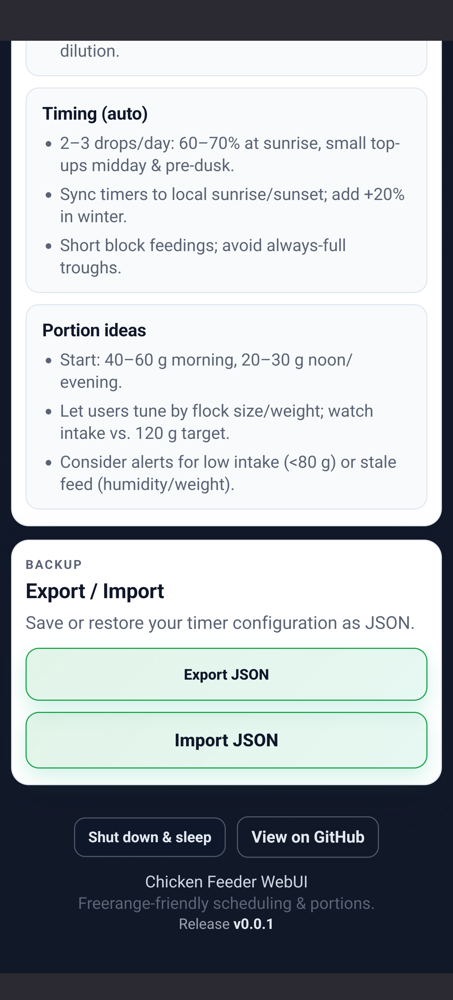
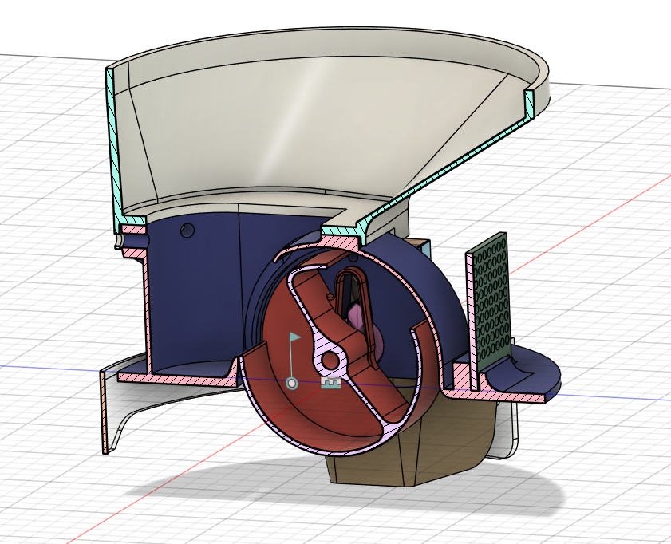
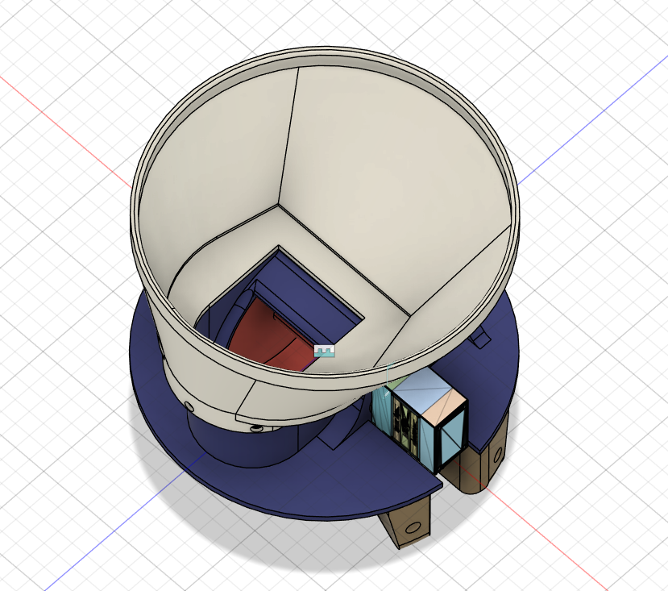

# 🐔 Automatic Chicken Feeder

> **Smart, battery-powered feeding system for your chickens with web-based scheduling and deep sleep power management**

An ESP32-C3 based automatic chicken feeder with RTC-scheduled feeding times, web configuration interface, and ultra-low power consumption. Perfect for keeping your chickens fed while you're away!

## 📸 Web Interface

| Schedule Configuration | Manual Control & Settings |
|:----------------------:|:--------------------------:|
|  |  |

## 🖨️ 3D Design

| Cross-Section | Animated View | Top View |
|:-------------:|:-------------:|:--------:|
|  |  |  |

## ✨ Features

- 🕐 **RTC-Based Scheduling** - DS3231 external RTC with alarm interrupts for precise feeding times
- 📅 **Flexible Schedules** - Configure up to 6 feeding times with weekday selection (e.g., Mon-Fri only)
- 🌐 **Embedded Web Interface** - Complete configuration via WiFi AP, no SD card needed
- 📱 **Mobile-Optimized UI** - Smart View automatically shows relevant timers on mobile devices
- 🔋 **Ultra-Low Power** - Deep sleep mode (~10-20µA) with dual wakeup sources
- ⚡ **Smart Power Management** - Automatic sleep after 2 minutes inactivity
- 🎚️ **Configurable Portions** - 1-5 portion units (12g per unit)
- 🔘 **Physical Button Control** - Single/double/long-press for manual operation
- 🕒 **Automatic Time Sync** - Browser syncs time to RTC every 10 seconds
- 🌍 **Timezone Support** - Europe/Berlin (CET/CEST) timezone
- 🔄 **OTA Firmware Updates** - Update firmware over WiFi without USB cable

## 🎮 Button Controls

| Action | Function |
|--------|----------|
| **Single Click** | Start WiFi AP for configuration |
| **Double Click** | Manual feed (1 portion) |
| **Long Press** | Enter deep sleep immediately |
| **Press while sleeping** | Wake up + start AP mode (after 1s delay) |
| **Hold during boot** | Maintenance mode (optional, keeps WiFi on) |

## 🔧 Hardware Setup

### Components
- **Board:** Seeed Xiao ESP32-C3
- **RTC:** DS3231 external real-time clock module (I2C)
- **Servos:** 2x servo motors (GPIO2, GPIO21)
- **Button:** Push button with pull-up (GPIO4)
- **Power Control:** Transistor for servo power switching (GPIO5)

### GPIO Pin Assignment

| GPIO | Function | Direction | Notes |
|------|----------|-----------|-------|
| GPIO2 | Servo 1 | Output | PWM control |
| GPIO3 | RTC INT | Input (PULLUP) | Alarm wakeup |
| GPIO4 | Button | Input (PULLUP) | User input + wakeup |
| GPIO5 | Transistor | Output | Servo power control |
| GPIO21 | Servo 2 | Output | PWM control |
| I2C SDA | DS3231 | I/O | RTC communication |
| I2C SCL | DS3231 | I/O | RTC communication |

### Power Requirements
- **ESP32-C3:** 3.3V
- **Servos:** 5V with adequate current (500mA+ peak)
- **RTC:** 3.3V or 5V (with built-in level shifting)

## 🚀 Quick Start

### Prerequisites
- PlatformIO Core (`pip install platformio`) or VS Code extension
- Node.js (v18+) for web interface build
- GNU Make
- ESP32-C3 connected via USB

### Build & Flash

**IMPORTANT:** Always use `make build` instead of `pio run` directly!

```bash
# Full build (web UI + firmware)
make build

# Flash to device
make flash

# Flash and monitor serial output
make run

# With specific port
make run 1        # Flash + monitor on /dev/ttyACM1
```

### Why Use the Makefile?

The Makefile automates the complete build pipeline:

1. **Web UI Build** - Runs `npm install` and Vite build
2. **Header Generation** - Converts HTML/CSS/JS to gzipped C headers
3. **Firmware Compilation** - Embeds web files into ESP32 firmware

**Skipping `make` and using `pio run` directly will result in outdated web files!**

### Device Port Management

```bash
# Auto-detect port (single device)
make flash
make monitor

# Specific port (multiple devices)
make flash 2      # Flash to /dev/ttyACM2
make monitor 2    # Monitor /dev/ttyACM2
make run 1        # Flash + monitor on /dev/ttyACM1

# List connected ESP32 devices
make list
```

## ⚙️ Configuration

### Web Interface Setup

1. **Power on the device** or **press button once** to start WiFi AP
2. **Connect to WiFi:** `ChickenFeeder` (no password)
3. **Open browser:** Navigate to `http://192.168.4.1`
4. **Configure schedules:**
   - Set feeding times (HH:MM format)
   - Select weekdays (Mon-Sun)
   - Set portion units (1-5)
   - Enable/disable schedules
5. **Save configuration** - Stored in ESP32 NVS (non-volatile storage)

### Manual Time Sync
Time syncs automatically from your browser every 10 seconds while the web page is open. Initial setup requires opening the web interface once to set the RTC time.

### Config Import/Export
Download or upload your configuration as JSON for backup or transfer to another device.

### OTA Firmware Updates

Update firmware wirelessly without USB connection:

1. **Start WiFi AP:**
   - Press button once (or device wakes from sleep)
   - Connect to WiFi: `ChickenFeeder` (no password)

2. **Open web interface:** Navigate to `http://192.168.4.1`

3. **Upload firmware:**
   - Scroll to "Maintenance" section at bottom
   - Click "Select Firmware (.bin)"
   - Choose your `.bin` file (from `.pio/build/esp32c3/firmware.bin`)
   - Click "Upload Firmware"
   - Wait for progress bar to complete (~10-30 seconds)

4. **Device reboots automatically** with new firmware

**Important:**
- Only upload `.bin` files built for ESP32-C3
- Do not power off during upload
- Configuration data is preserved (stored in NVS)
- Optionally backup your configuration before updating (Export JSON)

## 🔋 Power Management

### Deep Sleep Mode

The system enters deep sleep (~10-20µA) to conserve battery power:

- **After 2 minutes** of inactivity (no button press, no web client)
- **After RTC alarm** feeding completes
- **Manual trigger** via long-press button

### Wakeup Sources

| Source | GPIO | Trigger | Action |
|--------|------|---------|--------|
| **Button** | GPIO4 | LOW | Wake → Wait 1s → Start AP |
| **RTC Alarm** | GPIO3 | LOW | Wake → Feed → Sleep |

### Stay-Awake Conditions
- WiFi AP has connected clients
- Feeding operation in progress
- Any button press (resets 2-minute timer)

### Battery Life Estimate

With a 2000mAh battery:
- **Deep sleep 23.5h/day:** ~11 years theoretical maximum
- **Realistic usage (30min active/day):** ~50 days

## 📁 Project Structure

```
AutomaticChickenFeeder/
├── src/
│   └── main.cpp                    # Main application
├── lib/
│   ├── ButtonService/              # Button input handling
│   ├── FeedingService/             # Dual servo control
│   ├── ClockService/               # DS3231 RTC management
│   ├── ConfigService/              # NVS configuration storage
│   ├── SchedulingService/          # Event queue & RTC alarms
│   └── WebService/                 # AsyncWebServer & captive portal
├── web/
│   ├── src/
│   │   ├── app.js                  # Web UI logic
│   │   └── styles.css              # Modern UI styling
│   ├── index.html                  # Main page
│   └── vite.config.js              # Build configuration
├── scripts/
│   └── web-to-header.py            # Converts web files to C headers
├── Makefile                        # Build automation
├── platformio.ini                  # PlatformIO configuration
└── AGENTS.md                       # Development guidelines

```

## 🛠️ Development

### Build Workflow

**After ANY code change (backend OR frontend):**
```bash
make build    # or just: make
```

**Frontend-only changes:**
```bash
make web-headers    # Rebuild web UI headers
pio run             # Compile firmware
```

**Backend-only changes:**
```bash
make build    # Still use make! Ensures web files are current
```

### Creating a Release

**Single command to create and publish a release:**
```bash
make release VERSION=v2.1.0
```

This will automatically:
- Update version in all files
- Rebuild web interface with new version
- Commit, tag, and push to GitHub
- Trigger automated release build

See [docs/RELEASE.md](docs/RELEASE.md) for details.

### Service Architecture

```
main.cpp
├── ButtonService (GPIO4)
│   ├── Single click → Start AP
│   ├── Double click → Manual feed
│   └── Long press → Deep sleep
├── FeedingService (GPIO2, GPIO21, GPIO5)
│   ├── Dual servo control
│   ├── Transistor power switching
│   └── Multi-portion feeding
├── ClockService (I2C @ 0x68)
│   ├── DS3231 RTC time management
│   ├── Timezone conversion (UTC → CET/CEST)
│   └── Alarm programming
├── ConfigService (NVS)
│   ├── 6 schedules storage
│   └── Portion unit configuration
├── SchedulingService
│   ├── Event queue (50 events, 7 days)
│   ├── Weekday mask filtering
│   └── RTC alarm management
└── WebService (WiFi AP)
    ├── AsyncWebServer (port 80)
    ├── Captive portal DNS
    ├── REST API endpoints
    └── Time sync (browser → RTC)
```

## 📚 Documentation

- **[AGENTS.md](AGENTS.md)** - Comprehensive development guidelines and build system documentation
- **[docs/dev.md](docs/dev.md)** - Development setup and troubleshooting
- **[docs/web-development.md](docs/web-development.md)** - Web interface development guide

## 🤝 Contributing

1. Fork the repository
2. Create a feature branch
3. Make your changes
4. Test thoroughly (hardware + web interface)
5. Submit a pull request

## 📝 License

This project is open source. See LICENSE file for details.

## 🙏 Acknowledgments

Built with:
- [PlatformIO](https://platformio.org/) - Embedded development platform
- [ESP32Servo](https://github.com/madhephaestus/ESP32Servo) - Servo control library
- [Button2](https://github.com/LennartHennigs/Button2) - Button handling
- [RTClib](https://github.com/adafruit/RTClib) - DS3231 RTC library
- [ESPAsyncWebServer](https://github.com/me-no-dev/ESPAsyncWebServer) - Async web server
- [Vite](https://vitejs.dev/) - Frontend build tool

---

**Made with ❤️ for happy chickens** 🐔
