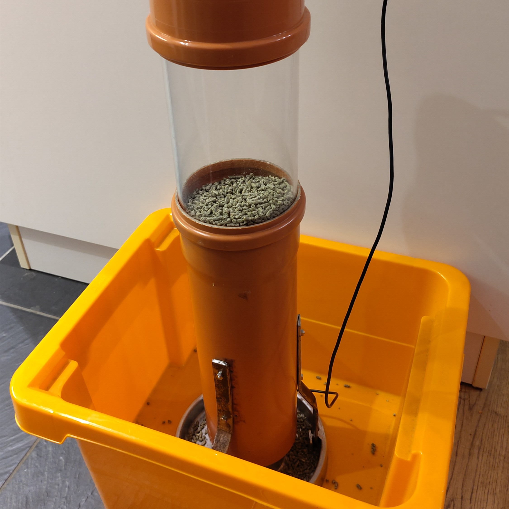
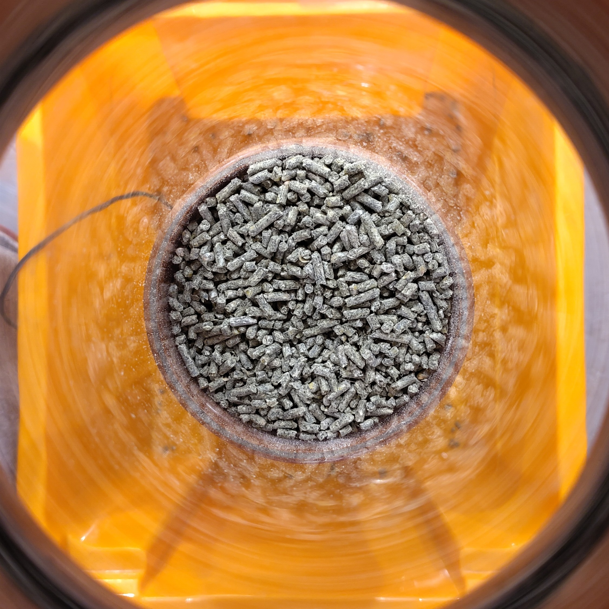
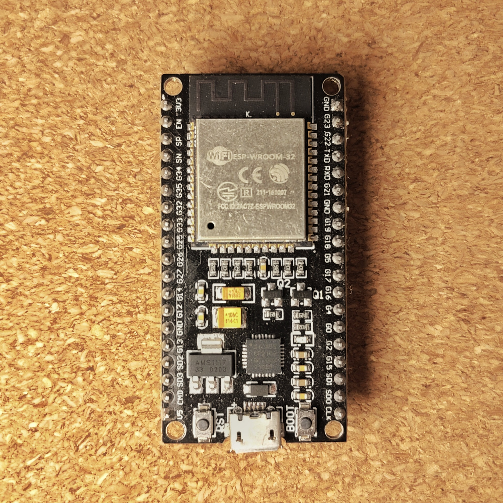
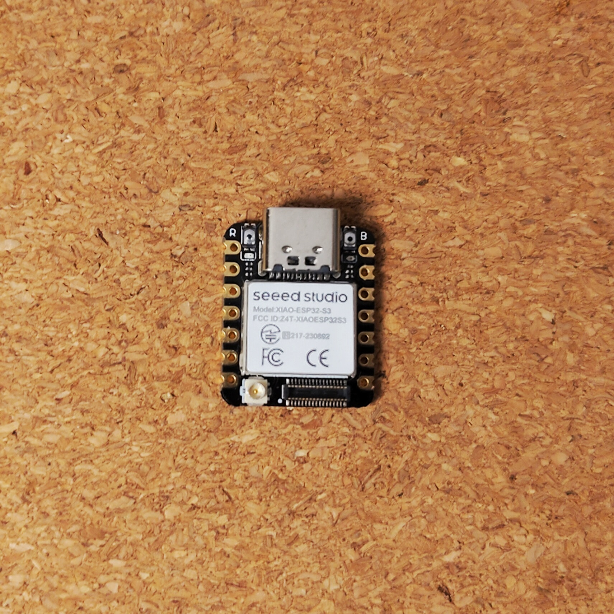
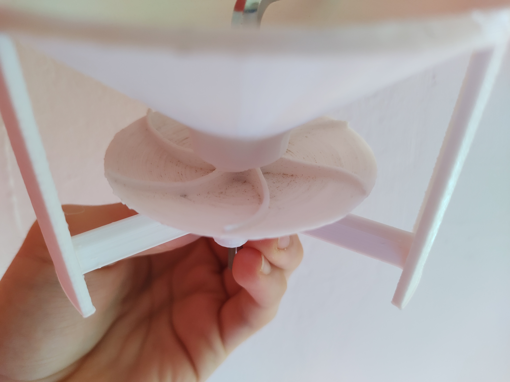

# Automatic chicken feeder

## Overview
The automatic chicken feeder is a project developed to automate chicken feeding. This system aims to enhance efficiency in poultry farming, optimize feed distribution, and minimize the daily maintenance efforts required for poultry care.

</img>
</img>
</img>

The system operates on an ESP32 microcontroller and features a web-based user interface for configuring feeding schedules and quantities. It can be powered either by a battery or a power adapter and includes a power-saving mode to prolong battery life. Additionally, the system establishes a secure Wi-Fi network to facilitate system configuration and monitoring.

## Features
- Automated feeding at pre-set times
- Customizable feeding schedules and quantities via a web-based user interface
- Secure storage of feeding data in the microcontroller's non-volatile memory
- Establishment of a secure Wi-Fi network for system configuration and monitoring
- Power-saving mode capability to extend battery life

## Hardware
- ESP32DEV or ESP32S3 microcontroller (refer to images below)
- Motor control module, such as a servo motor
- DS3231 Real-Time Clock module for precise timekeeping
- Compatible with smartphones, tablets, or computers equipped with a web browser and Wi-Fi
- Versatile power supply options: battery or power adapter

</img>
</img>

### 3D Printed Components
> Note: STL files for 3D printing will be available shortly.

This section outlines the key 3D printed components essential for assembling the automatic chicken feeder. These parts have been meticulously designed to ensure easy assembly and efficient operation of the feeder.

- **Funnel at the top**: Serves as the primary entry point for the feed, guiding it smoothly into the system.
- **Spreading Disc**: A critical component responsible for evenly distributing the feed.
- **Spreading Disc Holder**: Provides stable support to the spreading disc, ensuring reliable operation.
- **Distance Holder**: Aids in maintaining the correct spacing between various components.
- **Battery Pack Holder**: Securely houses the battery, ensuring a consistent power supply.
- **Allen Wrench**: A tool included for easy assembly and adjustment of the components.

Each component plays a vital role in the functionality of the feeder, contributing to its overall effectiveness and ease of use.

</img>

The image illustrates the key components of the feeder: the funnel, spreading disc, spreading disc holder, and distance holder. Centrally located, an Allen wrench is utilized to securely attach the spreading disc to the motor.

## Installation and Configuration
1. Clone this repository.
2. Rename `data/config.json-template` to `data/config.json` and change the default values to your preferences.
```bash
mv data/config.json-template data/config.json
```
3. Install dependencies (VSCode extension PlatformIO IDE and PlatformIO Core).
4. Configure the `platformio.ini` file to select the correct board and port, or start a Nix shell.

```bash
nix-shell
```

## Usage Instructions for ESP in Access Point Mode
When operating the ESP in Access Point mode, it generates a dedicated WiFi network. To access the ESP's web server, use the following default IP address: http://192.168.4.1. Simply open a web browser and input this IP address to interact with the web services and functionalities offered by the ESP32.

### ESP32 Microcontroller Pinout
The table below details the pinout configuration of the ESP32 microcontroller. Please note that the pinout for the DS3231 RTC module and the motor control module may differ based on the manufacturer's specifications.

| ESP32S3 | ESP32DEV | RTC | Motor   |
| ------- | -------- | --- | ------- |
| 4       | 21       | SDA | -       |
| 5       | 22       | SCL | -       |
| 7       | 4        | INT | -       |
| 8       | 2        | -   | CONTROL |
| 3.3V    | 3.3V     | VCC | VCC     |
| GND     | GND      | GND | GND     |

### Flashing Firmware from the Release Section
> Before proceeding, it's essential to create your own littlefs.bin file. For guidance on building this file, refer to the section about the [Makefile](#build-the-project-with-the-makefile). Without this, the configuration file will be absent, leading to improper functioning of the system.

In the release section, the latest firmware binaries for the microcontrollers are available. Use the commands below to flash these binaries onto the ESP32DEV or ESP32S3 microcontroller.

**First, you must install the `esptool`:**

```bash
pip install esptool
```

> Note: Ensure you have Python and pip installed on your system before running the above command.

#### firmware.bin, bootloader.bin and partitions.bin (ESP32)
```bash
esptool.py --port /dev/ttyUSB0 --baud 921600 --before default_reset --after hard_reset write_flash -z --flash_mode dio --flash_freq 40m --flash_size detect 0x1000 bootloader.bin 0x8000 partitions.bin 0x10000 firmware.bin
```
Change the `--port` parameter to match your system configuration and the path to the binary files.

#### firmware.bin (ESP8266)
```bash
esptool.py --port /dev/ttyUSB0 --baud 921600 --before default_reset --after hard_reset write_flash -z --flash_mode dio --flash_freq 40m --flash_size detect 0x10000 firmware.bin
```
Change the `--port` parameter to match your system configuration and the path to the binary files.

#### littlefs.bin (ESP32 and ESP8266)
```bash
esptool.py --port /dev/ttyUSB0 --baud 921600 --before default_reset --after hard_reset write_flash -z --flash_mode dio --flash_freq 40m --flash_size detect 0x290000 littlefs.bin
```
Change the `--port` parameter to match your system configuration and the path to the binary files.

## Contributions and Collaboration Opportunities

This project thrives on community involvement and we wholeheartedly welcome contributions and collaboration. Whether you're looking to implement new features, optimize existing functionalities, or fix bugs, your input is invaluable. 

- **Creating Issues**: If you encounter a bug or have a suggestion for an enhancement, please open a new issue on our repository. This helps us track and address diverse user needs and feedback.
- **Pull Requests**: Feel encouraged to fork the repository and submit pull requests. Whether it’s a minor fix or a substantial feature addition, your contributions help drive the project forward.
- **Code Review and Discussion**: Engage in discussions or review code changes submitted by others. Your insights and feedback are crucial for maintaining high-quality code and innovative features.
- **Sharing Expertise and Knowledge**: If you have expertise in a specific area relevant to the project, such as advanced programming techniques, efficient algorithms, or user interface design, please share your knowledge to enhance the project's development.

We're excited to see how you can help shape and evolve this project. Together, we can achieve more!

### Build the project with the `Makefile`
To select the appropriate board for your project, modify the BOARD variable in the Makefile. The default setting for this variable is esp32dev. To build the project with your specified settings, use the command below:

```bash
make build
```

To flash the project onto the microcontroller, use the command provided below:

```bash
make flash
```

To set up the file system, utilize the commands outlined below.
> It is necessary to relocate or modify the `config.json` file within the data folder. For detailed instructions on configuring this file, please refer to the `config.json-template` file.

```bash
make fs
make uploadfs
```

For access to more advanced commands, utilize the **help** command.

```bash
make help
```

## Sources and helpful links
- [PlatformIO and ESP32](https://docs.platformio.org/en/latest/platforms/espressif32.html): Comprehensive guide for using PlatformIO with ESP32 microcontrollers.
- [ESP32 Datasheet](https://www.espressif.com/sites/default/files/documentation/esp32_datasheet_en.pdf): Detailed technical specifications of the ESP32 microcontroller.
- [DS3231 RTC](https://www.analog.com/media/en/technical-documentation/data-sheets/DS3231.pdf): Technical datasheet for the DS3231 Real-Time Clock module.
- [RTC Interrupt](https://github.com/IowaDave/RTC-DS3231-Arduino-Interrupt): Guide to using interrupts with the DS3231 RTC on Arduino.
- [RTC Synchronization](https://github.com/Friedjof/SyncRTC): Project for synchronizing the RTC with external time sources.
- [Battery Operation](https://randomnerdtutorials.com/power-esp32-esp8266-solar-panels-battery-level-monitoring/): Guide to powering ESP32 and ESP8266 with solar panels and battery level monitoring.
- [ESP32 Deep Sleep](https://randomnerdtutorials.com/esp32-deep-sleep-arduino-ide-wake-up-sources/): Instructions on using the ESP32's deep sleep mode and its wake-up sources.
- [ESP32S3 Datasheet](https://www.espressif.com/sites/default/files/documentation/esp32-s3_datasheet_en.pdf): Technical details and specifications of the ESP32S3 microcontroller.


## Authors
- [Friedjof Noweck](https://github.com/Friedjof)
- [Bernhard schlagheck](https://github.com/bschlagheck)
