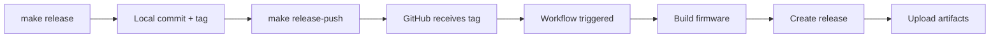

# Release Process

This document describes how to create and publish a new release of the Automatic Chicken Feeder firmware.

## Prerequisites

- Git repository with clean working directory
- Node.js installed (for web build)
- Python 3 installed (for web-to-header conversion)
- PlatformIO installed
- Push access to the GitHub repository

## Release Workflow

### Single Command Release

```bash
make release VERSION=v2.1.0
```

**That's it!** This single command will:

1. ✅ Update `VERSION` file with the version number
2. ✅ Update `web/package.json` version
3. ✅ **Rebuild web interface with new version** (embedded in firmware)
4. ✅ Create a git commit with message "Release vX.X.X"
5. ✅ Create a git tag `vX.X.X`
6. ✅ **Push to GitHub automatically**
7. ✅ **Trigger GitHub Actions Release Build**

**Example Output:**
```
🐔 Starting automated release v2.1.0...

📝 Step 1/5: Updating version files...
✅ Version files updated

🌐 Step 2/5: Building web interface with new version...
✅ Web interface built and embedded

📦 Step 3/5: Committing release...
✅ Release committed

🏷️  Step 4/5: Creating and pushing tag...
✅ Tag v2.1.0 created

🚀 Step 5/5: Pushing to GitHub...
📤 Pushing branch: v2.0
📤 Pushing tag: v2.1.0

✅ ✅ ✅ Release v2.1.0 completed! ✅ ✅ ✅

🔗 GitHub Actions: https://github.com/Friedjof/AutomaticChickenFeeder/actions
🔗 Releases: https://github.com/Friedjof/AutomaticChickenFeeder/releases

⏳ The release build will take ~5-10 minutes
📦 Artifacts: firmware-v2.1.0.bin, firmware-v2.1.0.elf
```

### Monitor GitHub Actions

After pushing the tag:
1. Go to: https://github.com/Friedjof/AutomaticChickenFeeder/actions
2. Watch the "Release Build" workflow
3. Wait for completion (~5-10 minutes)

### 5. Verify Release

Once the GitHub Action completes:
1. Go to: https://github.com/Friedjof/AutomaticChickenFeeder/releases
2. You should see the new release `vX.X.X` with:
   - `firmware-vX.X.X.bin` - Ready for OTA upload
   - `firmware-vX.X.X.elf` - For debugging
   - Auto-generated release notes

## What Gets Built

The GitHub Action performs these steps:

1. **Checkout code** at the tagged version
2. **Install dependencies** (Node.js, Python, PlatformIO)
3. **Build web interface** (Vite build)
4. **Convert to C headers** (embedded in firmware)
5. **Build firmware** for ESP32-C3
6. **Package binaries** with version suffix
7. **Create GitHub Release** with artifacts

## Release Artifacts

### firmware-vX.X.X.bin
- **Use for:** OTA updates via web interface
- **How:** Upload via http://192.168.4.1 → Maintenance → Firmware Update
- **Size:** ~500KB - 1MB (depending on features)

### firmware-vX.X.X.elf
- **Use for:** Debugging with GDB
- **How:** `pio debug --environment esp32c3`
- **Contains:** Symbols for crash analysis

## Partition Table

The firmware uses `min_spiffs.csv` partition scheme:
- **OTA_0:** ~1.9MB (active firmware)
- **OTA_1:** ~1.9MB (update target)
- **SPIFFS:** Minimal (~64KB for NVS config)

This allows seamless OTA updates without USB cable.

## Version Numbering

Follow Semantic Versioning (semver):
- `vMAJOR.MINOR.PATCH`

Examples:
- `v2.0.0` - Major release (breaking changes)
- `v2.1.0` - Minor release (new features)
- `v2.1.1` - Patch release (bug fixes)

## Rollback Procedure

If a release has critical bugs:

1. **Quick fix:** Revert to previous tag
   ```bash
   git revert <commit-hash>
   make release VERSION=v2.1.1
   make release-push
   ```

2. **Emergency:** Users can manually flash older firmware
   ```bash
   pio run -e esp32c3 -t upload
   ```

## Troubleshooting

### GitHub Action fails

**Check logs:**
1. Go to Actions tab
2. Click failed workflow
3. Expand failed step

**Common issues:**
- **Web build fails:** Check `web/package.json` syntax
- **Firmware too large:** Remove debug symbols or optimize code
- **Permission denied:** Check repository settings → Actions → General → Workflow permissions

### Release not appearing

**Verify tag was pushed:**
```bash
git ls-remote --tags origin
```

**Should show:**
```
abc123...  refs/tags/v2.1.0
```

**If missing:**
```bash
git push origin v2.1.0
```

### Can't create tag (already exists)

**Delete local tag:**
```bash
git tag -d v2.1.0
```

**Delete remote tag (DANGEROUS):**
```bash
git push origin :refs/tags/v2.1.0
```

Then re-run `make release`.

## CI/CD Pipeline



## Best Practices

1. **Always test locally first:**
   ```bash
   make build
   make flash
   # Test all features
   ```

2. **Update CHANGELOG.md** before release

3. **Use descriptive commit messages:**
   - ✅ "Add OTA firmware update feature"
   - ❌ "fix stuff"

4. **Tag format:** Always use `v` prefix (e.g., `v2.1.0`, not `2.1.0`)

5. **Pre-release testing:**
   - Test on actual hardware
   - Verify OTA update works
   - Check deep sleep behavior
   - Confirm RTC scheduling

## Emergency Hotfix

For critical production bugs:

```bash
# From main branch
git checkout -b hotfix/v2.0.1
# Fix the bug
git commit -m "Fix critical feeding bug"
make release VERSION=v2.0.1
make release-push
# Merge back
git checkout v2.0
git merge hotfix/v2.0.1
git push origin v2.0
```

## Release Checklist

Before creating a release:

- [ ] All tests pass locally
- [ ] Web interface works in browser
- [ ] OTA update tested
- [ ] Deep sleep tested
- [ ] RTC scheduling verified
- [ ] Documentation updated
- [ ] CHANGELOG.md updated
- [ ] Version number decided
- [ ] Clean git status (`git status`)

After release:

- [ ] GitHub Action completed successfully
- [ ] Release appears on GitHub
- [ ] Binaries downloadable
- [ ] Release notes look correct
- [ ] Test OTA update from release binary

## Support

For issues with releases:
- Open issue: https://github.com/Friedjof/AutomaticChickenFeeder/issues
- Check Actions logs: https://github.com/Friedjof/AutomaticChickenFeeder/actions
- Review release docs: `docs/RELEASE.md`
