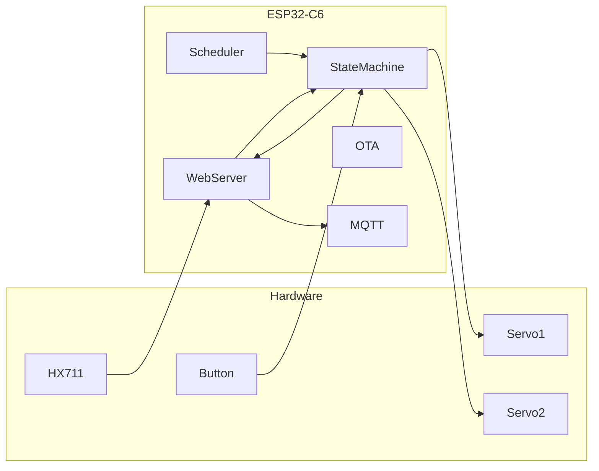

# System Architecture

## 1. Overview

The Automated Chicken Feeder is based on an **ESP32-C6** microcontroller platform.  
It controls a dual-servo scoop mechanism to dispense food at scheduled times and provides remote monitoring and configuration through a web dashboard.

---

## 2. Hardware Architecture

### 2.1 Components
- **ESP32-C6 Microcontroller** – Main controller, Wi-Fi enabled.
- **Servo Motors (x2)** – Controls the feeding scoop (rotation and tilt).
- **Load Cell (HX711)** – Measures remaining feed quantity.
- **Optional Sensors** – Temperature and humidity sensor (e.g., DHT22).
- **Power Supply** – AC adapter or optional solar-based power.

### 2.2 Block Diagram (Logical)

```mermaid
graph TD
    A[ESP32-C6 MCU] --> B1[Servo 1 - Scoop Rotation]
    A --> B2[Servo 2 - Scoop Tilt]
    A --> C[Load Cell HX711]
    A --> D[Temp & Humidity Sensor]
    A --> E[Wi-Fi Module]
    E --> F[Web Dashboard]
    E --> G[MQTT Home Assistant]
    A --> H[Physical Button]
    A --> I[Power Supply]
````

---

## 3. Software Architecture

### 3.1 Layered Structure

* **Application Layer**

  * Feeding Scheduler
  * Web Dashboard
  * Notifications (Email/Telegram)
* **Service Layer**

  * Feeding Component (servo sequence controller)
  * Sensor Data Management
  * OTA Firmware Updater
* **Hardware Abstraction Layer**

  * Servo Control (espressif/servo)
  * HX711 Driver
  * GPIO (button input)
  * Wi-Fi stack

---

### 3.2 Feeding Component State Machine

```mermaid
stateDiagram-v2
    [*] --> IDLE
    IDLE --> INIT : feeding_start()
    INIT --> EMPTYING : init complete
    EMPTYING --> LOADING : after 3s
    LOADING --> READY : after 3s
    READY --> IDLE : reset cycle
```

**States:**

* **IDLE** – System ready, waiting for schedule or manual trigger.
* **INIT** – Initializing scoop position.
* **EMPTYING** – Dispensing feed.
* **LOADING** – Returning scoop to loading position.
* **READY** – Feeding cycle completed.

---

### 3.3 Communication & Interfaces

* **Wi-Fi** – Provides local web dashboard and optional MQTT.
* **MQTT** – Optional integration with smart home platforms (Home Assistant).
* **OTA** – Firmware update without physical access.
* **GPIO** – Local manual feed button.

---

## 4. Data Flow



---

## 5. Security & Reliability

* **Password-protected Web Dashboard**
* **OTA update signing (planned)**
* **Watchdog Timer** to reset system on faults
* **Fail-safe servo positions** in case of power loss

---

## 6. Scalability

The architecture allows for:

* Adding new sensors (e.g., camera module or environmental sensors).
* Expanding feeding mechanism control (e.g., multiple feeding hoppers).
* Enhanced integration with external platforms via MQTT or REST APIs.

---

## 7. Dependencies

* **ESP-IDF** v5.4+
* **espressif/servo** library
* **HX711 driver** (custom or third-party)
* **DHT22 library** (optional)
