# Circuit Diagram - Automated Chicken Feeder

Hardware schematic for the ESP32-C6 based chicken feeding system with servo control and manual button input.

---

## 1. Complete System Overview

```mermaid
graph TD
    subgraph ESP32C6["Seeed XIAO ESP32-C6"]
        GPIO1["GPIO1 (D1)<br/>(Pull-up internal)"]
        GPIO18["GPIO18 (D10)"]
        GPIO19["GPIO19 (D8)"]
        GPIO21["GPIO21 (D3)"]
        VCC3V3["3.3V"]
        GND_ESP["GND"]
    end
    
    subgraph Power["Power Supply"]
        VCC5V["5V Supply"]
        GND_PWR["GND"]
    end
    
    subgraph Button["Manual Feed Button"]
        BTN["Taster (NO)"]
    end
    
    subgraph ServoControl["Servo Power Control"]
        R1["1kΩ"]
        Q1["2N2222 NPN"]
    end
    
    subgraph Servos["Servo Motors"]
        SERVO1["Servo 1 (Rotation)"]
        SERVO2["Servo 2 (Tilt)"]
    end
    
    %% Power flow through transistor control
    VCC5V --> Q1
    Q1 --> SERVO1
    Q1 --> SERVO2
    GND_PWR --> Q1
    GND_PWR --> SERVO1
    GND_PWR --> SERVO2
    GND_PWR --> GND_ESP
    
    %% Button circuit (simplified - pull-up is internal)
    GPIO1 --> BTN
    BTN --> GND_ESP
    
    %% Servo power control
    GPIO21 --> R1
    R1 --> Q1
    
    %% Servo signal connections
    GPIO18 --> SERVO1
    GPIO19 --> SERVO2
    
    classDef vcc fill:#cc4444
    classDef gnd fill:#444444
    classDef signal fill:#005555
    classDef control fill:#332200
    
    class VCC5V,VCC3V3 vcc
    class GND_ESP,GND_PWR gnd
    class GPIO1,GPIO18,GPIO19,GPIO21 signal
    class Q1,R1,BTN control
```



---

## 2. Manual Feed Button Circuit

```mermaid
graph LR
    subgraph ButtonCircuit["Button Input Circuit"]
        VCC3V3["3.3V"] 
        PULLUP["10kΩ Pull-up<br/>(ESP32 internal)"]
        GPIO1["GPIO1<br/>(D1)"]
        BUTTON["Manual Feed<br/>Button"]
        GND["GND"]
    end
    
    VCC3V3 -.-> PULLUP
    PULLUP --> GPIO1
    GPIO1 --> BUTTON
    BUTTON --> GND
    
    classDef vcc fill:#cc4444
    classDef gnd fill:#444444
    classDef signal fill:#005555
    classDef input fill:#774400
    
    class VCC3V3 vcc
    class GND gnd
    class GPIO1 signal
    class BUTTON input
```



**Button Logic:**
- **Not Pressed**: GPIO1 = HIGH (3.3V via pull-up)
- **Pressed**: GPIO1 = LOW (0V via GND connection)
- **Interrupt**: Falling edge detection (HIGH → LOW)

---

## 3. Servo Power Control Circuit

```mermaid
graph TB
    subgraph PowerControl["Servo Power Switching"]
        GPIO21["GPIO21 (D3)"]
        R1["1kΩ Base<br/>Resistor"]
        Q1["2N2222 NPN<br/>Transistor"]
        VCC5V["5V Supply"]
        GND["GND"]
    end
    
    subgraph ServoLoad["Servo Motors Load"]
        SERVO1_PWR["Servo 1<br/>Power"]
        SERVO2_PWR["Servo 2<br/>Power"]
    end
    
    GPIO21 --> R1
    R1 --> Q1
    VCC5V --> Q1
    Q1 --> SERVO1_PWR
    Q1 --> SERVO2_PWR
    Q1 --> GND
    SERVO1_PWR --> GND
    SERVO2_PWR --> GND
    
    classDef control fill:#4d6b3d
    classDef vcc fill:#cc4444
    classDef gnd fill:#444444
    classDef load fill:#aa6633
    
    class GPIO21,R1,Q1 control
    class VCC5V vcc
    class GND gnd
    class SERVO1_PWR,SERVO2_PWR load
```



**Power Control Logic:**
- **GPIO21 HIGH**: Transistor ON → Servos powered
- **GPIO21 LOW**: Transistor OFF → Servos unpowered

---

## 4. Pin Assignment Table

| Function | ESP32-C6 GPIO | XIAO Label | Component | Notes |
|----------|---------------|------------|-----------|-------|
| Manual Button | GPIO1 | D1 | Taster → GND | Pull-up enabled, interrupt-capable |
| Servo 1 Signal | GPIO18 | D10 (MOSI) | PWM Signal | Scoop rotation control |
| Servo 2 Signal | GPIO19 | D8 (SCK) | PWM Signal | Scoop tilt control |
| Servo Power | GPIO21 | D3 | 2N2222 Base | Power switching via transistor |

---

## 5. Component List

### Active Components
- **1x** Seeed XIAO ESP32-C6 Development Board
- **1x** 2N2222 NPN Transistor (TO-92 package)
- **2x** MG90S Servo Motors (or compatible 180° servos)

### Passive Components  
- **1x** 1kΩ Resistor (Base resistor for 2N2222)
- **1x** Push Button (Normally Open)

### Power Supply
- **1x** 5V Power Supply (≥2A for servo operation)

---

## 6. Physical Connections

### 2N2222 Transistor Pinout (TO-92)
```
Looking at flat side:
    E  B  C
    |  |  |
    1  2  3

E = Emitter → GND
B = Base → GPIO21 via 1kΩ 
C = Collector → +5V & Servo Power
```

### Servo Connections
```
Servo 1 (Rotation):
- Red → +5V (via transistor)
- Brown/Black → GND  
- Orange/Yellow → GPIO18

Servo 2 (Tilt):
- Red → +5V (via transistor)
- Brown/Black → GND
- Orange/Yellow → GPIO19
```

---

## 7. Safety Notes

- **Power Supply**: Use regulated 5V supply with adequate current capacity (≥2A)
- **Transistor Heat**: 2N2222 may require small heatsink under continuous operation
- **Servo Stall**: Implement timeout protection in software to prevent servo damage
- **ESD Protection**: Handle ESP32-C6 with appropriate ESD precautions

---

## 8. Testing Points

- **Button Test**: Monitor GPIO1 state changes via serial output
- **Power Control**: Measure 5V at servo inputs when GPIO21 is HIGH
- **Servo Signals**: Verify PWM signals on GPIO18/19 using oscilloscope
- **Current Draw**: Monitor total system current consumption

---